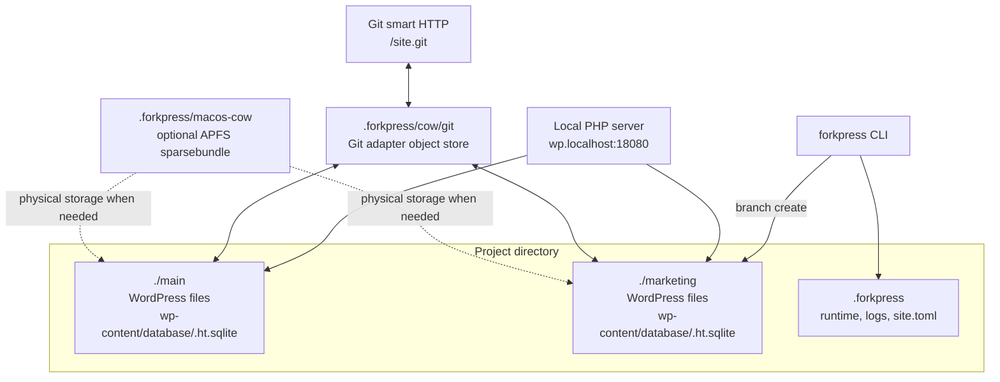
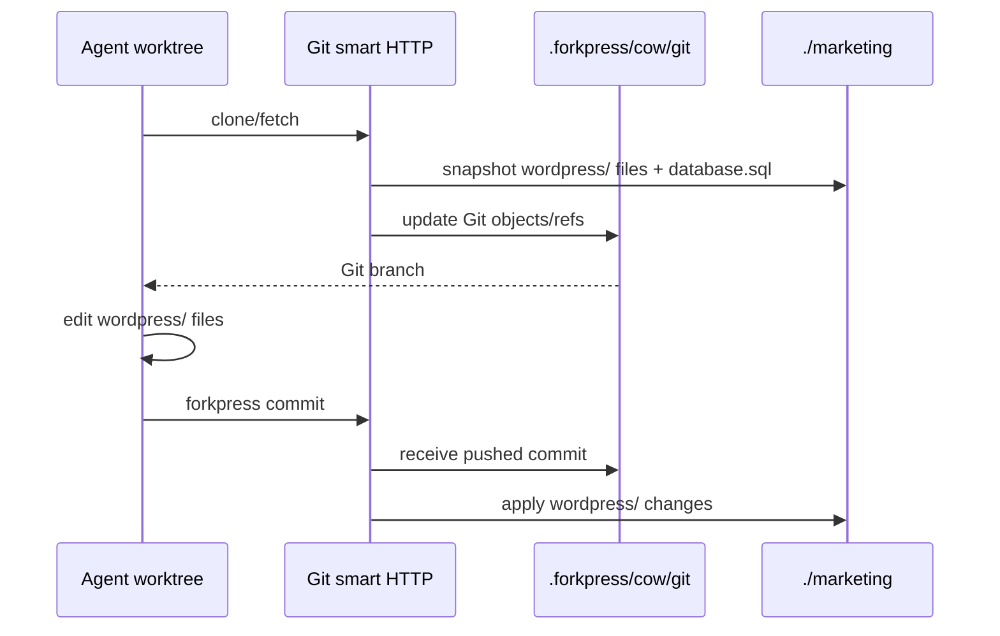

# ForkPress

ForkPress is a single-binary local WordPress branch runner for agent work.

The product path is now the **COW materialized backend**. `forkpress init`
creates ordinary branch directories beside `.forkpress`, such as `./main` and
`./marketing`. Each branch is a normal WordPress tree with its own SQLite
database file, and branch creation uses filesystem copy-on-write when the
machine can provide it.

No Docker, no system PHP, no MySQL daemon, no FUSE service, and no helper
daemon. The release artifact is one `forkpress` binary on macOS/Linux and a
click-through installer on Windows.

## Quick Start

Start in an empty project directory:

```bash
./forkpress init
./forkpress serve
```

Open:

```text
http://wp.localhost:18080/
http://wp.localhost:18080/wp-admin/
```

The admin opens logged in by default. To use the normal WordPress login form,
start the server with:

```bash
FORKPRESS_AUTO_LOGIN=0 ./forkpress serve
```

Stop the site server and detach any mount-backed COW storage:

```bash
./forkpress stop
```

## Install

Download the archive for your machine from a release, unpack it, and run the
binary.

Windows:

1. Download `ForkPressSetup.exe` from a release.
2. Open it and follow the prompts.
3. Accept the Windows permission prompt.
4. Reboot only if Windows asks.
5. Open **Start ForkPress Site** from the desktop or Start Menu.

The Windows installer installs protected program files under
`%ProgramFiles%\ForkPress`, creates a ReFS Dev Drive VHDX at
`%ProgramData%\ForkPress\Storage\forkpress-dev-drive.vhdx`, mounts it at
`%USERPROFILE%\ForkPressDevDrive`, adds `forkpress.exe` to the user PATH, creates
`%USERPROFILE%\ForkPressDevDrive\Sites\My ForkPress Site`, runs `forkpress init`
there, and creates shortcuts. It does not require WSL, Docker, FUSE, WinFsp, or
manual Windows feature setup.

macOS:

```bash
case "$(uname -m)" in
  arm64) TARGET=aarch64-apple-darwin ;;
  x86_64) TARGET=x86_64-apple-darwin ;;
  *) echo "Unsupported Mac architecture: $(uname -m)" >&2; exit 1 ;;
esac

curl -L -o forkpress.tar.gz \
  "https://github.com/Automattic/forkpress/releases/download/<tag>/forkpress-$TARGET.tar.gz"

tar -xzf forkpress.tar.gz
chmod +x forkpress
./forkpress --version
```

Release targets:

- `x86_64-pc-windows-msvc`
- `aarch64-apple-darwin`
- `x86_64-apple-darwin`
- `aarch64-unknown-linux-musl`
- `x86_64-unknown-linux-musl`

## Work With Branches

Create a branch:

```bash
./forkpress branch create marketing
```

That creates:

```text
.forkpress/        # ForkPress metadata, runtime, logs, COW bookkeeping
main/              # main WordPress tree
marketing/         # marketing WordPress tree
```

Preview the branch:

```text
http://marketing.wp.localhost:18080/
http://marketing.wp.localhost:18080/wp-admin/
```

The WordPress admin bar shows `Branch: <name>`. Hover it to filter and switch
between local branches.

Reset a branch back to another branch:

```bash
./forkpress branch reset marketing --from main
```

That replaces `./marketing` with a fresh COW clone of `./main`, including the
branch-local SQLite database. ForkPress refuses to reset `main` unless you pass
`--force`.

## Git Workflow

ForkPress exposes a Git smart-HTTP view at:

```text
http://wp.localhost:18080/site.git
```

Clone it:

```bash
./forkpress clone http://wp.localhost:18080/site.git site
cd site
```

The checkout has this shape:

```text
site/
  database.sql        # read-only snapshot of the current branch DB
  wordpress/          # editable WordPress files
```

Switch to a ForkPress branch:

```bash
git fetch origin
git switch marketing
```

Create a Git branch from a fetched ForkPress branch and push it. ForkPress will
materialize the matching COW branch when it receives the new Git ref:

```bash
git switch -c marketing origin/main
../forkpress commit -m "create marketing branch"
```

Edit files under `wordpress/`, then push them back into the materialized COW
branch:

```bash
printf "hello from marketing\n" > wordpress/wp-content/marketing.txt
../forkpress commit -m "marketing file change"
```

Preview the pushed file:

```text
http://marketing.wp.localhost:18080/wp-content/marketing.txt
```

Delete the remote Git branch when you want to remove the matching preview
branch:

```bash
git push origin --delete marketing
```

ForkPress accepts one branch update per Git push. Push branch creates, updates,
and deletes one branch at a time.

`database.sql` is generated for model context. Edits to `database.sql` are
ignored on push; database changes should happen through WordPress, WP-CLI, or
another tool operating on the branch's own SQLite database.
The snapshot includes user tables, table rows, explicit indexes, triggers, and
views, while omitting SQLite and ForkPress driver internals. Credential-shaped
columns and key/value rows, such as WordPress password hashes, session tokens,
application passwords, and plugin API tokens, are redacted before the snapshot
is written into the Git view.
`wordpress/wp-content/database/` is private runtime state and is not part of the
Git view; ForkPress ignores pushed files under that path.
After a push, ForkPress immediately re-snapshots the branch so the remote Git
ref reflects the generated `database.sql`, not a user-edited copy. Successful
push cleanup also prunes unreachable loose objects from `.forkpress/cow/git`,
including Git snapshots left behind by deleted or force-updated preview refs.
`forkpress commit` fetches that normalized ref and fast-forwards your checkout
when possible, so generated files and ignored private runtime paths do not leave
the worktree one commit behind the preview server.

## Run Agents

With the site server running:

```bash
./forkpress agents
```

This creates ten ForkPress branches and ten Git worktrees:

```text
forkpress-agents/site
forkpress-agents/agent-1
forkpress-agents/agent-2
...
forkpress-agents/agent-10
```

Each `agent-N` worktree is checked out on its matching ForkPress branch.

Create fewer or differently named worktrees:

```bash
./forkpress agents --count 3 --prefix experiment
```

After an agent edits files:

```bash
cd forkpress-agents/experiment-1
../../forkpress commit -m "experiment 1 changes"
```

Preview it at:

```text
http://experiment-1.wp.localhost:18080/
```

## Logs And Debugging

Show WordPress critical errors and PHP fatals:

```bash
./forkpress logs --file wp
```

Follow new WordPress log output while reproducing a browser problem:

```bash
./forkpress logs --file wp --follow
```

Print every known log path:

```bash
./forkpress logs --file all --paths
```

Useful log files:

- `wp`: `.forkpress/logs/wp-debug.log`
- `php`: `.forkpress/logs/php-errors.log`
- `server`: `.forkpress/logs/php-server.log`
- `forkpress`: `.forkpress/logs/forkpress-server.log`
- `gc`: `.forkpress/logs/gc.log`

## How COW Storage Works

ForkPress records the selected storage strategy in `.forkpress/site.toml`:

```toml
version = 1
strategy = "cow"
file_view = "reflink"
```

The COW backend has three layers:



The durable WordPress state for a branch is the branch directory itself. A post
save on `marketing.wp.localhost` writes to:

```text
./marketing/wp-content/database/.ht.sqlite
```

It does not write to `./main`, and it does not use SQL views, overlay tables,
or branch table prefixes.

ForkPress-served WordPress requests take a shared advisory lock at
`.forkpress/cow/operations.lock`. COW mutations such as branch create, reset,
delete, and Git apply take the same lock exclusively, so ForkPress does not
publish or remove a branch tree while one of its own HTTP requests is active.
Direct shell/editor writes to `./main` or `./marketing` are normal filesystem
writes and do not participate in that lock.

### File View Cascade

ForkPress tries the cheapest ordinary-file view first:

1. **Native filesystem cloning in the project directory.** On macOS this uses
   APFS `clonefile`; on Linux this uses `FICLONE` reflinks; on Windows this
   uses ReFS block cloning when the project lives on a ReFS/Dev Drive volume.
   New branches share unchanged file blocks with the source branch. Writes to a
   branch path do not mutate the source path.
2. **Rootless APFS sparsebundle on macOS.** If the project volume cannot clone files,
   ForkPress creates `.forkpress/macos-cow/branches.sparsebundle`, mounts it at
   `.forkpress/macos-cow/mount`, stores the physical branch trees there, and
   exposes public branch directories like `./main` and `./marketing`.
3. **Guided ReFS Dev Drive setup on Windows.** If a Windows project is not on
   clone-capable storage, the Windows installer runs the Dev Drive setup flow
   and creates ForkPress shortcuts into `%USERPROFILE%\ForkPressDevDrive`.
4. **Full file copy.** This is the final fallback when COW storage is not
   available.

Inspect the selected file view:

```bash
./forkpress storage status
./forkpress doctor storage
```

`storage status` also reports branch count, the public branch root, the physical
storage root, the COW lifecycle locks, and any leftover staging directories from
interrupted branch operations.

If a sparsebundle is attached, stop through ForkPress before deleting or moving
the project:

```bash
./forkpress stop
rm -rf .forkpress main marketing
```

On sparsebundle-backed sites, reclaim free space inside the image after branch
churn:

```bash
./forkpress storage compact
```

Compaction stops this site's server, detaches the sparsebundle, runs
`hdiutil compact`, and leaves storage detached. Run `./forkpress serve` or
`./forkpress storage mount` to attach it again.

If macOS reports the storage is busy, close terminals or editors inside
`.forkpress/macos-cow/mount` and run `./forkpress stop` again. Use
`./forkpress stop --force` only for cleanup after normal detach reports a busy
mount.

### Git Is An Interface

Git is not the source of truth. It is an editing and transport view over the
COW branch directories.



Before every Git request, ForkPress snapshots each branch directory into the
Git adapter store. After a push, ForkPress applies only `wordpress/` changes
back to the target branch directory, excluding private runtime paths such as
`wp-content/database/`. The branch's SQLite database remains branch-local and is
never overwritten by `database.sql`.

## Production And Dev Builds

The production binary is `forkpress`. It only exposes the materialized COW
strategy and its file-view cascade:

- macOS APFS `clonefile`;
- macOS APFS sparsebundle fallback;
- Linux `FICLONE` reflinks;
- full file-copy fallback.

Experimental storage work is compiled into `forkpress-dev`, not `forkpress`.
The dev binary enables:

- the older BranchFS/SQLite strategy;
- the Redb CAS manifest strategy;
- hidden embedded-ZFS smoke tooling. The native ZFS engine still requires an
  explicit `FORKPRESS_ENABLE_EMBEDDED_ZFS=1` build because it fetches and links
  the external OpenZFS experiment.

## Repository Layout

Production Rust packages live under `crates/`:

- `forkpress-cli`: binaries and high-level command routing;
- `forkpress-core`: shared layout, manifest, path, and strategy types;
- `forkpress-storage`: production COW branch storage, including APFS
  `clonefile`, APFS sparsebundle, Linux `FICLONE`, Windows ReFS block cloning,
  and file-copy fallback;
- `forkpress-runtime`: embedded PHP/WordPress runtime preparation and PHP
  script execution;
- `forkpress-server`: server registry, stop/list, and TCP readiness helpers;
- `forkpress-git`: Git command, ref, worktree, and push-sync helpers.

Production PHP runtime files live in `runtime/`, production/shared helper
scripts live in `scripts/`, and production COW PHP tests live in `tests/`.
Experiment-specific code lives under `experiments/`, including BranchFS, CAS
Rust crates, the experiment WordPress plugin, and the embedded-ZFS smoke
tooling.

## Commands

- `forkpress init` initializes a site. On macOS the default strategy is `cow`.
- `forkpress init --admin-password admin` creates a COW site with a known
  local admin password.
- `forkpress serve` starts the server in the background.
- `forkpress start` starts the server in the foreground.
- `forkpress stop` stops this site's server and detaches mount-backed storage.
- `forkpress stop --all` stops every running ForkPress site server for your
  user.
- `forkpress server list` lists running site servers.
- `forkpress branch list` lists local branches.
- `forkpress branch create <name> [--from main]` creates a COW branch.
- `forkpress branch reset <name> --from <source>` replaces one COW branch with
  the files and SQLite database from another branch.
- `forkpress branch merge-audit [--format text|json] [--run ID]`
  `[--scope all|db|files] [--records all|conflicts|decisions]`
  `[--conflict-type TYPE] [--decision DECISION] [--path PATH]`
  `[--path-prefix PREFIX] [--id-band-skips] [--review]`
  `[--review-status pending|needs-action|reviewed]` prints the COW merge audit log
  without opening the raw metadata database.
- `forkpress branch merge-review conflict|decision <id> --status pending|needs-action|reviewed --note <text>`
  `[--reviewer NAME]` appends a review note to an auditable merge conflict or decision.
- `forkpress branch merge-resolve conflict <id> --choice source|target [--apply]`
  `[--note TEXT] [--reviewer NAME]` validates an audited explicit-PK DB cell,
  row insert-collision, row-target-deleted, or row-source-deleted conflict and,
  with `--apply`, records the deterministic resolution in merge metadata.
- `forkpress branch show <name>` prints the branch directory, database, file
  count, and Git ref path.
- `forkpress branch delete <name>` removes a COW branch. `main` cannot be
  deleted.
- `forkpress clone [remote] [dir]` wraps `git clone`.
- `forkpress agents [dir] --count 10 --prefix agent` creates agent branches
  and worktrees.
- `forkpress commit -m "message"` stages, commits, and pushes the current Git
  branch back into ForkPress.
- `forkpress pull` wraps `git pull --rebase --autostash`.
- `forkpress logs --file wp|php|server|forkpress|gc|all` prints logs.
- `forkpress storage status|mount|detach|compact` diagnoses or manually manages
  detachable COW storage.
- `forkpress doctor storage` probes local filesystem clone support.

## Build From Source

```bash
make dist
make forkpress
```

`make dist` builds the production static PHP runtime. `make forkpress` embeds
that runtime and the PHP/WordPress assets into the production Rust binary.

Developer experiment build:

```bash
make dist-dev
make forkpress-dev
```

`make dist-dev` adds the experimental BranchFS/CAS PHP runtime support, and
`make forkpress-dev` builds the Rust binary with the `dev-experiments` Cargo
feature. The production wrapper rejects `dev-experiments`; use
`--bin forkpress-dev` whenever that feature is enabled.

For fast Rust-only checks without rebuilding PHP:

```bash
cargo test --workspace --exclude forkpress-cli
cargo test -p forkpress-core --features dev-experiments
FORKPRESS_RUNTIME_BUNDLE=/dev/null cargo test -p forkpress-cli
FORKPRESS_RUNTIME_BUNDLE=/dev/null cargo test -p forkpress-cli --features dev-experiments --bin forkpress-dev
```

PHP unit tests:

```bash
make test-cow
make test-branchfs
make test-all
```

`tests/` contains production COW tests. Experiment-specific runtime files,
Rust crates, and tests live with their experiment code under `experiments/`.
There are no generic PHP tests shared by both storage families yet; common
behavior is covered through the COW and experiment-specific suites.

## Publish

Push a version tag:

```bash
git tag v0.1.13
git push origin v0.1.13
```

The release workflow builds and uploads the target archives listed above.
