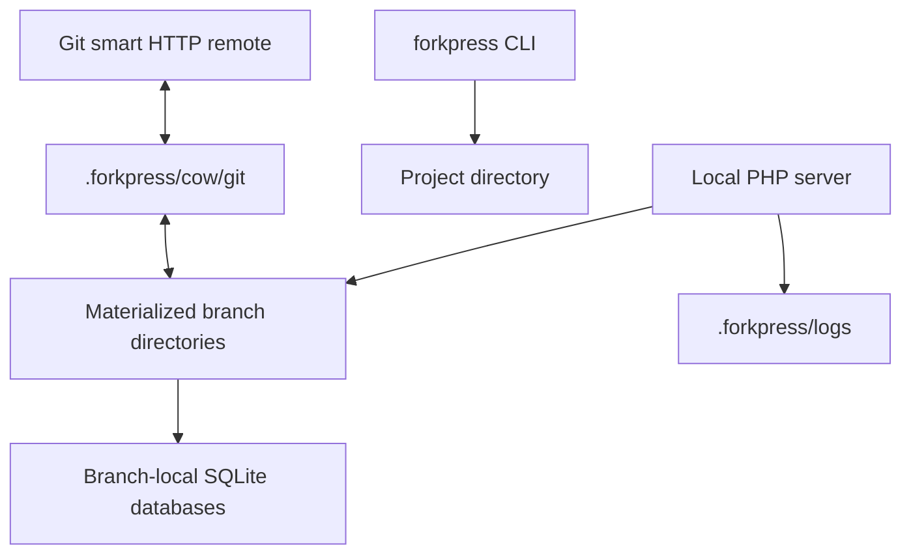

# Architecture

ForkPress is built around two ideas: materialized copy-on-write branch
directories, and one static `forkpress` binary per target.

## What it isn't

Production ForkPress does **not** require:

- Docker;
- system PHP;
- MySQL;
- FUSE;
- helper daemons;
- service sidecars.

The binary embeds the PHP/WordPress runtime assets it needs to create and
serve local branch previews.

## Runtime model

The branch directory is the runtime source of truth. The Git adapter
snapshots branch directories for Git clone/fetch/push and applies pushed
`wordpress/` changes back into those directories.

## Repository layout

Production Rust packages live under `crates/`:

| Crate | Role |
| --- | --- |
| `forkpress-cli` | Binaries and high-level command routing. |
| `forkpress-core` | Shared layout, manifest, path, and strategy types. |
| `forkpress-storage` | Production copy-on-write branch storage. |
| `forkpress-runtime` | Embedded PHP/WordPress runtime preparation and PHP script execution. |
| `forkpress-server` | Server registry, stop/list helpers, and TCP readiness checks. |
| `forkpress-git` | Git command, ref, worktree, and push-sync helpers. |

Production runtime files live in `runtime/`. Shared helper scripts live in
`scripts/`. Windows installer files live under `installer/windows/` and
`scripts/windows/`. Production copy-on-write PHP tests live in `tests/`.
