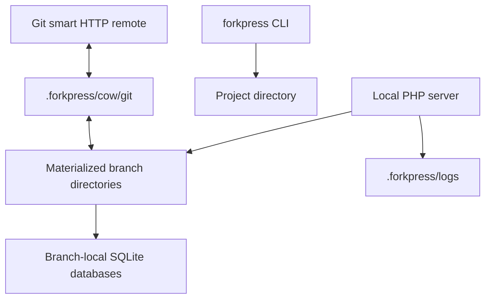

# Architecture

ForkPress production builds center on the materialized copy-on-write storage
model and one `forkpress` binary per target.

## Product shape

ForkPress production does not require:

- Docker;
- system PHP;
- MySQL;
- FUSE;
- helper daemons;
- service sidecars.

The binary embeds the PHP/WordPress runtime assets it needs to create and serve
local branch previews.

## Runtime model

The branch directory is the runtime source of truth. The Git adapter snapshots
branch directories for Git clone/fetch/push and applies pushed `wordpress/`
changes back into those directories.

## Repository layout

Production Rust packages live under `crates/`:

- `forkpress-cli`: binaries and high-level command routing;
- `forkpress-core`: shared layout, manifest, path, and strategy types;
- `forkpress-storage`: production COW branch storage;
- `forkpress-runtime`: embedded PHP/WordPress runtime preparation and PHP
  script execution;
- `forkpress-server`: server registry, stop/list helpers, and TCP readiness;
- `forkpress-git`: Git command, ref, worktree, and push-sync helpers.

Production runtime files live in `runtime/`, shared helper scripts live in
`scripts/`, Windows installer files live under `installer/windows/` and
`scripts/windows/`, and production COW PHP tests live in `tests/`.
