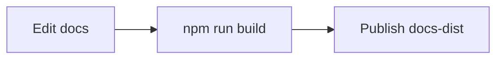

# Documentation site

The documentation site is an Astro Starlight project at the repository root. It
loads Markdown and MDX files from their existing locations instead of requiring a
separate docs source tree.

## Content sources

The `docs` content collection loads:

- `README.md`
- `docs/**/*.{md,mdx}`
- package and component `README.md` files under existing project directories

Route IDs are generated from repository-relative source paths. The root
`README.md` becomes the site index, and nested `README.md` files use their parent
directory path.

## Commands

Install dependencies:

```bash
npm install
```

Run the local development server:

```bash
npm run dev
```

Build the static site, Pagefind search index, and LLM text files:

```bash
npm run build
```

Validate the documentation site in CI:

```bash
npm run validate
```

Preview the built site locally:

```bash
npm run preview
```

The build publishes `docs-dist/`, including `llms.txt`, `llms-full.txt`, and the
Pagefind search index.

## Mermaid diagrams

The docs build renders fenced `mermaid` code blocks as diagrams. Use this form
in Markdown:

````markdown

````

The Mermaid integration must run before Starlight in `astro.config.mjs` so
Starlight receives transformed diagram nodes instead of syntax-highlighted code
blocks.
