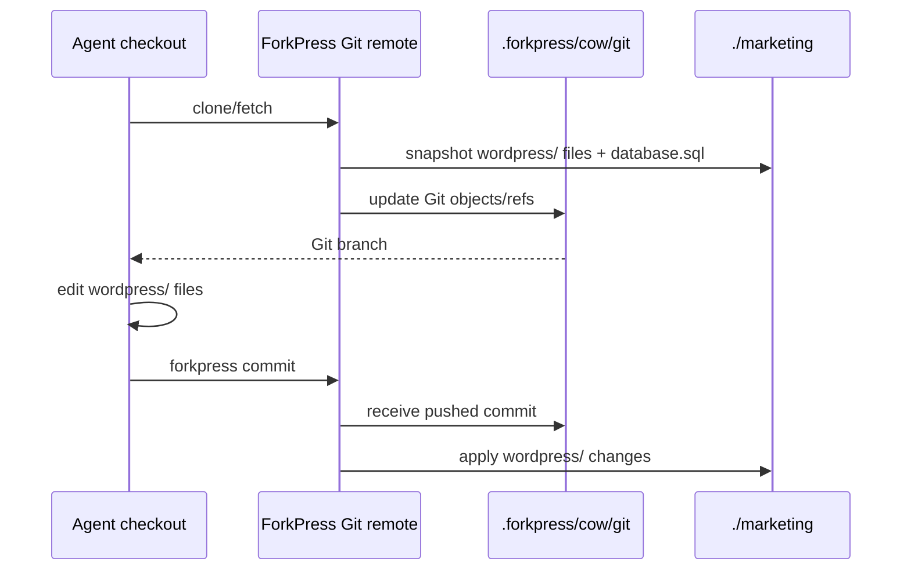

# Git workflow

ForkPress exposes each site as a Git smart-HTTP remote:

```text
http://wp.localhost:18080/site.git
```

Git is an editing and transport interface. The source of truth remains the
materialized branch directory.

For command options, see [`forkpress clone`](./cli/clone.md),
[`forkpress commit`](./cli/commit.md), [`forkpress push`](./cli/push.md), and
[`forkpress pull`](./cli/pull.md).



## Clone and edit

```bash
forkpress clone http://wp.localhost:18080/site.git site
cd site
git fetch origin
git switch marketing
```

The checkout contains:

```text
database.sql        # generated database snapshot for model context
wordpress/          # editable WordPress files
```

Edit files under `wordpress/`, then push the current branch back to ForkPress:

```bash
forkpress commit -m "Update marketing page"
```

Preview the pushed branch:

```text
http://marketing.wp.localhost:18080/
```

## Database snapshots

`database.sql` is generated from the branch-local SQLite database. It includes
user tables, rows, explicit indexes, triggers, and views. SQLite internals and
ForkPress SQLite-driver metadata are omitted.

Credential-shaped columns and key/value rows, such as WordPress password
hashes, session tokens, application passwords, and plugin API tokens, are
redacted before the snapshot is written into the Git view.

Edits to `database.sql` are ignored on push. Database changes should happen
through WordPress, WP-CLI, or another tool operating on the branch database.

`wordpress/wp-content/database/` is private runtime state. ForkPress omits that
directory from snapshots and ignores pushed files under that path.

## Push normalization

Before each Git request, ForkPress snapshots branch directories into
`.forkpress/cow/git`. Direct edits in `./main` or `./marketing` become visible
to Git on the next clone or fetch.

After a push, ForkPress applies only the pushed `wordpress/` tree back to the
target branch directory, excluding private runtime paths. It immediately
snapshots the branch again so the remote ref matches the server-side source of
truth. That normalized ref removes pushed `database.sql` edits and ignored
private runtime paths.

`forkpress commit` fetches the normalized ref after a successful push and
fast-forwards the local checkout when possible.

ForkPress accepts one branch update per Git push. Creating, updating, or
deleting preview branches should happen one branch at a time.
