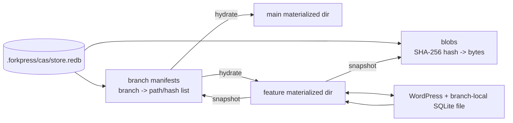
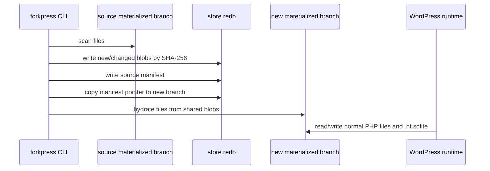
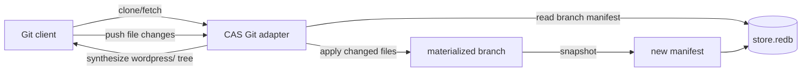
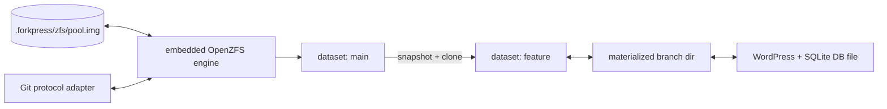

# Storage Driver Notes

Status: 2026-04-29

This is a working design note for ForkPress storage drivers. It records what
ships today, what is experimental, and what we have learned while embedding the
OpenZFS engine.

ForkPress has a single-binary constraint: each release target ships as one
`forkpress` executable with no daemon, shared library, kernel module, Docker
service, FUSE mount, or system PHP dependency. A storage driver is only viable
if it can fit that constraint or if the product explicitly changes the
constraint.

## Driver Summary

| Driver | Current status | Upsides | Downsides |
| --- | --- | --- | --- |
| BranchFS + SQLite COW | Default production driver. `strategy = "branchfs"`. | Small and portable. One `.forkpress/site.fp` file stores files, branch metadata, users, Git snapshots, and WordPress tables. Git smart HTTP is wired. Works with the bundled PHP runtime and does not need a host database. | Complex SQL compatibility surface. WordPress writes MySQL-shaped SQL that is translated to SQLite, then routed through branch views, overlays, tombstones, and triggers. Some plugin/query patterns can hit SQLite-view edge cases. File and DB versioning are separate layers that must be kept in sync by ForkPress code. |
| Materialized ZFS strategy | Experimental runtime path. `strategy = "zfs"` creates ordinary branch directories under `.forkpress/zfs/branches`. | Simple for WordPress: each branch is just a normal WP tree plus its own `wp-content/database/.ht.sqlite`. No BranchFS stream wrapper and no SQL-level branch overlays. Browser/admin workflows already exercise normal file and SQLite writes. | Not yet backed by ZFS datasets for normal branch operations. Branch creation currently materializes/copies branch directories. Git smart HTTP is not wired for this strategy. It is easy to understand but not the final storage model. |
| Embedded OpenZFS engine | Built into Linux and macOS ForkPress binaries; exposed by `forkpress zfs smoke`. | Real OpenZFS primitives inside the single binary: pool image, dataset create, snapshot, clone, export/import, logical file read/write. This is the path toward branch = ZFS dataset, create branch = snapshot + clone, and no SQL overlays. | Native OpenZFS userland is C code with strong POSIX assumptions. We had to add Darwin shims for endian, `uio`, `types32`, `libintl`, `dirent64`, error codes, `O_DIRECT`, SIMD auxv, `fstat64_blk`, and mutex teardown. Current engine API is narrow and not yet connected to branch import/export or Git. License review is required because OpenZFS is CDDL. |
| CAS + Redb manifests | Experimental runtime path. `strategy = "cas"` creates ordinary branch directories under `.forkpress/cas/branches` and stores blobs/manifests in `.forkpress/cas/store.redb`. | Pure Rust, single-binary friendly, and portable across Linux/macOS/Windows in principle. Branch creation shares unchanged file blobs by copying a manifest pointer in Redb. WordPress still sees normal files and a branch-local SQLite database file. | The materialized branch directory is still a full runtime view, so there is not yet a lazy filesystem. Git smart HTTP is not wired. SQLite database files are versioned as files, so semantic DB merge remains future work. Snapshot consistency while a branch is being actively written needs branch locking before this becomes production-grade. |
| System ZFS | Not a ForkPress driver. Useful only as background comparison. | Mature snapshots/clones when the host already has OpenZFS installed. Kernel/filesystem integration means normal programs can read datasets directly. | Violates the single-binary constraint. Requires host kernel modules or platform filesystem drivers, admin permissions, installation, unload/upgrade handling, and platform-specific support. Not acceptable for the default local-agent distribution. |
| Dolt | Future candidate, not shipped. | Native database branching, commits, diffs, and merges. MySQL-compatible protocol could map well to WordPress's MySQL assumptions. | Dolt is a separate Go stack/server in its normal deployment model. Shipping it under the one-static-binary Rust constraint would require major integration work or a sidecar exception. It handles database state, not WordPress files, so we still need a file branch driver. |
| Turso/libSQL | Future candidate, not shipped. | SQLite-family technology with embeddable and replicated modes. Potentially attractive for branch-local databases and remote sync. | It does not automatically solve WordPress's MySQL dialect, branch merge semantics, or file versioning. We would still need a file driver and a clear model for per-branch DB isolation. |
| Plain filesystem copy/reflink | Useful primitive, not enough as the final driver. | Very easy to reason about. Ordinary files are easy for PHP, editors, backup tools, and debuggers. Reflinks/clones can be cheap on filesystems that support them. | No portable version graph. Reflink support and semantics differ by platform/filesystem. Rollback, merge, Git export, and garbage collection all become ForkPress responsibilities. |

## What Git Means In These Drivers

Git is an interface, not the storage source of truth.

For `branchfs`, Git smart HTTP is synthesized from `.forkpress/site.fp`.
`scripts/git_server/server.php` builds a temporary Git repository from BranchFS
file snapshots; on push, ForkPress applies `wordpress/` changes back into the
BranchFS file overlay and records a new file snapshot. `database.sql` is a
read-only context artifact and is ignored on push.

For the target ZFS driver, Git should source data from the ZFS branch dataset:
export `wordpress/` and a database snapshot from the dataset, accept pushed file
changes, write those changes into the target dataset, then snapshot. It should
not go through BranchFS tables.

For the CAS driver, Git should eventually source data from branch manifests in
`.forkpress/cas/store.redb`. The store is already tree-shaped enough to export
`wordpress/`; the missing pieces are `database.sql` generation from the
branch-local SQLite file, push application back into a materialized branch, and
snapshotting the result into a new manifest.

## CAS + Redb Model

The CAS driver is the first pure-Rust cheap-branching experiment:



Current behavior:

1. `forkpress init --strategy cas` bootstraps `main` as ordinary WordPress
   files under `.forkpress/cas/branches/main`.
2. ForkPress scans that branch, stores file bytes in Redb by SHA-256 hash, and
   writes a branch manifest.
3. `forkpress branch create feature --from main` snapshots the source branch,
   copies the source manifest to `feature`, and materializes `feature` from the
   shared blobs.
4. WordPress serves and writes the materialized branch directory. The SQLite
   database stays branch-local at `wp-content/database/.ht.sqlite`.

This proves the storage direction without requiring FUSE, a kernel filesystem,
or a sidecar daemon. The cost is that ForkPress has to decide when to snapshot
materialized changes back into Redb. Today it snapshots on init and branch
creation; explicit commit/checkpoint and Git integration still need to be
wired.

## CAS Tradeoffs And Open Decisions

The CAS driver should be read as a branch-storage experiment, not as a finished
replacement for `branchfs`. It answers one question well: can ForkPress create
cheap branches with a pure-Rust embedded store while keeping WordPress on
ordinary files? The answer is yes for local preview and post-save workflows.
The harder questions are snapshot timing, Git integration, database merge, and
garbage collection.

### What The CAS Store Owns

Redb is the durable metadata/blob store for the strategy:

- `blobs`: SHA-256 hash -> complete file bytes
- `branches`: branch name -> serialized manifest

The manifest is the branch tree: directories plus file paths, sizes, and blob
hashes. Branch creation snapshots the source materialized directory into Redb,
copies the manifest pointer to the new branch name, then hydrates that manifest
into `.forkpress/cas/branches/<branch>`.

The materialized directory is the runtime working copy. WordPress never reads
directly from Redb; it reads and writes normal files. That is intentional:
WordPress, PHP, the SQLite integration plugin, uploads, plugin/theme code, and
debugging tools all behave like they are using a normal filesystem.



### Upsides

- Single-binary fit is strong. Redb and SHA-256 hashing are Rust dependencies
  linked into `forkpress`; there is no kernel module, daemon, shared library,
  system database, FUSE mount, or Docker service.
- WordPress compatibility is better than a virtual filesystem path. PHP sees
  ordinary files, so `require`, plugin pages, uploads, and SQLite database
  writes avoid the BranchFS stream-wrapper and SQL-view compatibility surface.
- Branch creation can share unchanged bytes in the durable store. A new branch
  manifest can point at the same blob hashes as the parent instead of copying
  those bytes inside Redb.
- The durable model maps naturally to Git export. A manifest is already a tree;
  an adapter can synthesize Git trees from manifests without asking WordPress or
  BranchFS to resolve files.
- Debuggability is good. A broken branch can be inspected directly under
  `.forkpress/cas/branches/<branch>`, and the branch SQLite file is just
  `wp-content/database/.ht.sqlite`.
- Windows is more plausible than native ZFS. The strategy uses ordinary files
  plus Rust libraries, so the hard Windows kernel-driver problem does not apply.

### Downsides

- The runtime branch directory is still a full materialization. Redb dedupes
  durable blobs, but `.forkpress/cas/branches/<branch>` currently contains
  full file copies. Disk use is therefore "shared in the store, duplicated in
  the live working trees" until we add lazy hydration, reflinks, or sparse
  checkout behavior.
- Snapshot timing is explicit and incomplete. Today ForkPress snapshots on init
  and branch creation. WordPress can write files and the SQLite DB after that,
  but those changes are not durable in Redb until a later snapshot operation is
  wired.
- SQLite databases are treated as opaque files. That gives correct branch
  isolation, but not row-level database diffs or semantic database merges. A
  one-byte post change can rewrite a large SQLite blob in the CAS store.
- There is no Git smart HTTP for CAS yet. The current Git endpoint is still
  `branchfs`-specific; CAS needs a new adapter that exports manifests, applies
  pushed file changes to the materialized branch, then records a new manifest.
- Garbage collection is not implemented. Redb can accumulate blobs that no live
  branch manifest references. We need a mark-and-sweep pass over all branch
  manifests before this becomes a long-lived store.
- Branch operations need locking. Snapshotting while WordPress is writing
  `.ht.sqlite`, uploads, or plugin files can capture an inconsistent tree. CAS
  needs a per-branch lock and probably a SQLite checkpoint/flush step before
  snapshot.
- Binary blobs limit merge quality. This is fine for local preview isolation,
  but content-level merges for uploads and database files need higher-level
  policy.

### Redb vs Fjall

Redb is the implementation currently shipped because it is a small embedded
Rust key-value store with simple transactional tables. The current CAS shape
only needs two maps: blob hash to bytes, and branch name to manifest. That makes
Redb a good first fit.

Fjall remains worth evaluating for a future CAS backend. The likely tradeoff is
different rather than strictly better:

| Store | Why it fits | Risks / questions |
| --- | --- | --- |
| Redb | Simple embedded transactional tables; easy to package; good match for a small number of maps; no background daemon. | Large opaque blobs may rewrite more than we want; one-writer branch operations should be serialized; we need our own GC, manifest schema evolution, and large-blob/chunking policy. |
| Fjall | LSM-style storage may be attractive for write-heavy snapshots, range scans, and future chunk indexes; still Rust-embeddable and single-binary friendly. | Compaction behavior, write amplification, crash recovery semantics, and operational knobs need evaluation. ForkPress would still own branch manifests, locks, SQLite snapshot consistency, and Git integration. |

The store choice does not change the product model. Both Redb and Fjall would
need the same ForkPress-level pieces: branch manifests, blob/chunk references,
snapshot locks, manifest GC, Git export/import, and a database story.

### Database Strategy

For CAS, the database is deliberately branch-local:

```text
.forkpress/cas/branches/main/wp-content/database/.ht.sqlite
.forkpress/cas/branches/feature/wp-content/database/.ht.sqlite
```

This avoids BranchFS's hardest failure mode: MySQL-shaped WordPress writes
being translated to SQLite and then applied through branch SQL views. In CAS,
WordPress writes to one normal SQLite file owned by the current branch.

The tradeoff is mergeability. ForkPress can snapshot the SQLite file as a blob,
but it cannot yet explain "merge this post row from feature into main" at the
storage layer. We have a few future options:

- Keep database merge out of scope and treat branch DB state as preview-only
  unless exported through WordPress/WP-CLI-level operations.
- Generate `database.sql` for Git clone/fetch as read-only context, like
  `branchfs`, but ignore it on push.
- Add explicit database export/import commands that understand WordPress tables
  and merge at an application-aware layer.
- Pair CAS files with a future database-native branch driver such as Dolt or a
  libSQL/Turso-style design if the single-binary constraint can still be met.

### Git Strategy

CAS should eventually have its own Git adapter:



Clone/fetch can be manifest-only: read the branch manifest, stream file blobs
as a Git tree, and generate `database.sql` from the branch SQLite file if we
want the same context artifact as `branchfs`.

Push should not mutate Redb directly from Git objects. A safer path is:

1. Lock the target branch.
2. Apply pushed `wordpress/` file changes to the materialized branch.
3. Let ForkPress run any required managed-file refresh or validation.
4. Snapshot the materialized branch into Redb as a new manifest.
5. Unlock the branch.

That keeps the live WordPress view and durable CAS view in sync through one
path.

### Garbage Collection

CAS needs mark-and-sweep GC:

1. Read every live branch manifest from `branches`.
2. Mark every referenced file hash.
3. Delete unmarked blob rows from `blobs`.
4. Optionally compact the underlying store if the chosen engine supports it and
   it is safe to do so.

This is simpler than BranchFS row/table GC because manifests make reachability
explicit. It still needs locking so a branch create or snapshot cannot race
with blob deletion.

### When CAS Is The Right Experiment

CAS is the best near-term experiment when the goal is:

- stay inside the single-binary Rust distribution model
- avoid SQL-level branch overlays
- keep WordPress running against normal files
- make branch creation cheaper in the durable store
- keep Windows possible in a future release

CAS is not yet the right answer when the goal is:

- true lazy filesystem COW for runtime directories
- database-aware diffs/merges
- Git clone/push parity with `branchfs`
- production durability while WordPress writes concurrently
- long-lived stores without a GC/checkpoint story

The practical next milestone is a `forkpress cas snapshot <branch>` or
strategy-neutral `forkpress checkpoint <branch>` command that locks the branch,
flushes SQLite state, writes a manifest, and exposes enough metadata for Git
export.

## Target ZFS Model

The intended ZFS-backed driver is:



The key property is that files and the WordPress SQLite database file are
versioned together by the filesystem layer. A post save on a branch mutates that
branch's dataset state; it does not write SQL overlay rows against a parent
table. A branch checkpoint is a dataset snapshot.

Because the embedded engine is not a kernel filesystem mount, PHP cannot
`require` PHP files directly from an OpenZFS dataset. ForkPress still needs a
materialization boundary:

1. Export or hydrate the requested branch dataset into
   `.forkpress/zfs/branches/<branch>`.
2. Run WordPress against ordinary files in that directory.
3. Under a branch lock, import changed files and the SQLite database file back
   into the dataset.
4. Snapshot the dataset after explicit commit/checkpoint operations.

That boundary is less elegant than a kernel mount, but it preserves the
single-binary constraint.

## What We Learned Embedding ZFS

The embedded engine is based on the real-zfs/OpenZFS userland subset and is
linked as a static archive into the Rust binary. It currently builds and passes
CI smoke tests on:

- `x86_64-unknown-linux-musl`
- `aarch64-unknown-linux-musl`
- `x86_64-apple-darwin`
- `aarch64-apple-darwin`

The smoke test creates a file-backed pool image, creates a dataset, writes a
logical file, snapshots, clones, exports, imports, and reads from the clone.

Important implementation notes:

- The engine opens a sparse pool image through ordinary file APIs. It does not
  load kernel ZFS and does not mount a ZPL filesystem.
- The API is intentionally small: pool create/import/export, dataset create,
  snapshot, clone, logical file write, and logical file read.
- macOS required many compatibility shims because the upstream userland code is
  closer to Linux/FreeBSD assumptions than to Darwin.
- ARM64 builds should use the portable Fletcher checksum path for now. The
  OpenZFS ARM64 NEON path compiled, but keeping the embedded build on portable
  checksum code reduces platform-specific risk.
- Darwin `kernel_fini()` teardown asserted in userspace cleanup after
  successful operations. ForkPress now treats the Darwin ZFS engine as
  process-lifetime state and lets process exit reclaim it. That is acceptable
  for short-lived CLI smoke and command execution, but long-running server use
  should avoid repeated init/fini cycles.
- The browser Wasm demo proves the primitives are viable, but the demo artifact
  is not directly shippable for ForkPress because it expects an Emscripten
  JavaScript/Wasm runtime. ForkPress instead links native static code on Linux
  and macOS.

## Windows And ZFS

Windows is the hardest platform for a ZFS driver.

The official OpenZFS documentation focuses its getting-started pages on Unix
platforms such as Linux distributions and FreeBSD. The Windows work lives in a
separate OpenZFS-on-Windows fork. That fork's README describes the Windows port
as beta and recommends starting with test data before trusting it. Its Windows
development README expects Visual Studio, the Windows Driver Kit, host and
target Windows VMs, remote kernel debugging, Secure Boot changes, driver
deployment, and sometimes test-signing mode.

That matters for ForkPress because our constraint is not "can an expert install
ZFS on Windows"; it is "can a downloaded `forkpress.exe` contain everything it
needs without a sidecar or privileged install". A Windows kernel filesystem
driver cannot fit that model:

- It is not just a static library linked into `forkpress.exe`.
- It requires driver installation and usually administrator privileges.
- Driver signing, Secure Boot, Windows Update interactions, and crash recovery
  become product concerns.
- A kernel driver is a side effect on the host OS, not local project state under
  `.forkpress/`.
- The POSIX shims we added for Linux/macOS do not solve Windows APIs, path
  semantics, case sensitivity, drive letters, IO completion, security
  descriptors, file locking, or driver lifecycle.

The more plausible Windows options are:

- Keep `branchfs` as the default Windows-capable driver if/when the Rust/PHP
  release target exists.
- Use the materialized-directory strategy on Windows without embedded ZFS,
  accepting that branch copy/rollback is a ForkPress-level implementation.
- Explore a Wasm build of the ZFS engine embedded into the Rust binary with a
  Rust Wasm runtime. This may preserve the single-binary story, but it would be
  a separate engine path with different performance, threading, file IO, and
  debugging behavior.
- Explore non-ZFS database/file strategies, such as libSQL/Turso for DB state
  plus a separate file snapshot layer.

For now, embedded ZFS should be considered Linux/macOS only. Windows support
needs its own design pass rather than trying to extend the current Darwin/Linux
native shims.

## Decision Criteria For New Drivers

A candidate driver should be evaluated on:

- Single-binary fit: can it ship without sidecars, shared libraries, kernel
  modules, or system package installs?
- WordPress fit: can WordPress load PHP files normally and write plugin/theme
  files, uploads, options, posts, users, and schema changes?
- Branch isolation: can a write affect only the selected branch?
- Branch creation cost: can create branch be O(changed data), not a full copy?
- Merge/reset model: can ForkPress explain and implement merge, rollback, and
  garbage collection?
- Git protocol model: can clone/fetch/push be derived from the driver without a
  lossy intermediate format?
- Debuggability: can a user inspect files, DB state, and logs when WordPress
  fails?
- Portability: can it work on Linux and macOS now, and what is the honest path
  for Windows?
- License: can the dependency be distributed inside ForkPress under the planned
  release license?

## References

- OpenZFS documentation: https://openzfs.readthedocs.io/en/latest/
- OpenZFS platform/distribution notes: https://www.openzfs.org/wiki/Distributions
- OpenZFS on Windows fork: https://github.com/openzfsonwindows/openzfs
- OpenZFS on Windows development README:
  https://github.com/openzfsonwindows/openzfs/tree/windows/module/os/windows
- OpenZFS on OS X documentation: https://openzfsonosx.org/wiki/Documentation
