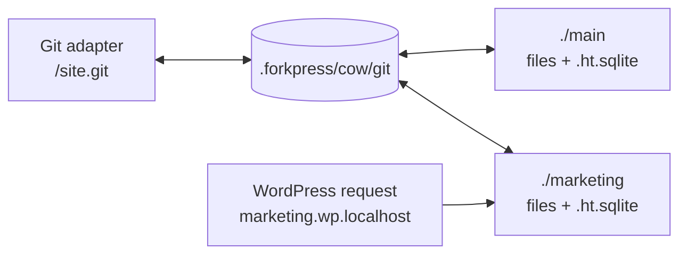
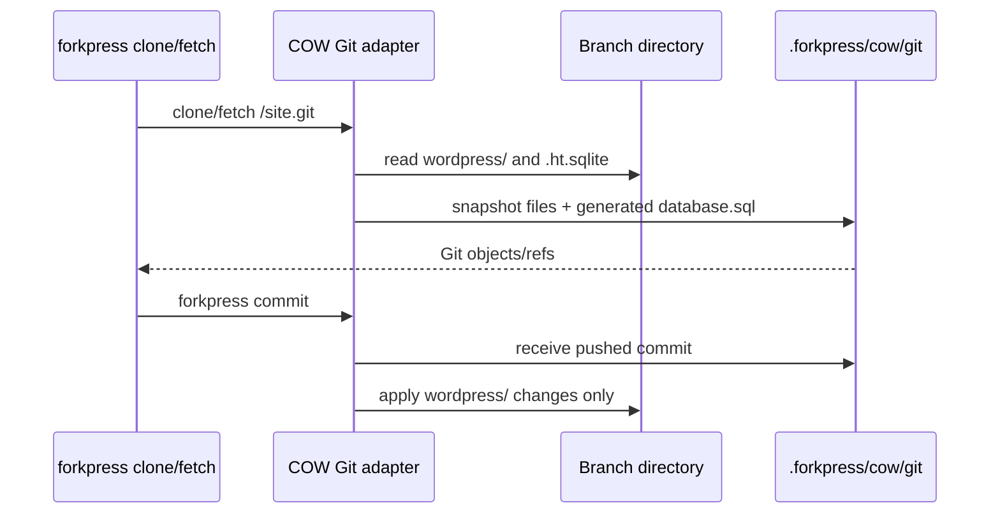

# Storage Driver Notes

Status: 2026-05-06

ForkPress production builds are focused on the **COW materialized driver**.
Other drivers are compiled only into `forkpress-dev`.

The distribution constraint still stands: one `forkpress` binary per target,
with no Docker runtime, system PHP, MySQL daemon, FUSE service, helper daemon,
or installed database server.

For the native-mount/lazy-overlay evaluation, see
[`docs/lazy-overlay-cow.md`](lazy-overlay-cow.md).

## Driver Summary

| Driver | Status | Use it for | Main gaps |
| --- | --- | --- | --- |
| COW materialized | Production path. `strategy = "cow"` in the manifest. | Normal WordPress directories, branch-local SQLite databases, Git clone/fetch/push, agent worktrees. | Semantic database merge between branches is still future work. |
| BranchFS + SQLite COW | Dev experiment. `forkpress-dev init --strategy branchfs`. | Older `.forkpress/site.fp` sites and compatibility research. | Complex SQL overlay surface: WordPress MySQL-shaped queries pass through SQLite translation plus branch views/triggers. |
| CAS + Redb manifests | Dev experiment. `forkpress-dev init --strategy cas`. | Lazy file-store research using Redb and the PHP `branchfs` extension. | Git smart HTTP, locking, GC, and production durability are not complete. |
| Embedded OpenZFS engine | Dev experiment. Code lives under explicit experiment paths. | Research only. Build `forkpress-dev` with `FORKPRESS_ENABLE_EMBEDDED_ZFS=1`; CLI smoke is hidden behind `FORKPRESS_ENABLE_ZFS_CLI=1`. | Not connected to branch operations. License/portability/product-shape questions remain. |

## COW Materialized Model

The COW driver keeps branch state in ordinary directories:

```text
.forkpress/
  site.toml
  cow/
    branches.txt
    git/                  # persistent Git adapter object store
  macos-cow/              # optional APFS sparsebundle fallback
  runtime/
  logs/
main/
  wp-content/database/.ht.sqlite
marketing/
  wp-content/database/.ht.sqlite
```

Each branch has:

- a complete WordPress file tree;
- its own SQLite database at `wp-content/database/.ht.sqlite`;
- no SQL overlay views;
- no parent table prefix;
- no shared mutable database file.

Writing to `./marketing/wp-content/database/.ht.sqlite` cannot affect
`./main/wp-content/database/.ht.sqlite` because they are different files.
Writing to `./marketing/wp-content/themes/...` cannot affect `./main/...`
because APFS/file clones are copy-on-write at the filesystem extent layer.



The branch directory is the runtime source of truth. `.forkpress/cow/git` is a
Git protocol adapter: it snapshots branch directories before clone/fetch/push
and applies pushed `wordpress/` file changes back to the branch directory.

## File View Cascade

ForkPress prefers ordinary paths because editors, shells, PHP, WP-CLI, backup
tools, and debuggers already know how to work with them.

This is APFS/file-level COW, not namespace-lazy overlay COW. New branches share
unchanged file contents through `clonefile`, but ForkPress still creates a full
directory namespace for each branch.

`forkpress init` chooses the first working file view:

1. **Native file clone in place.** The branch directories live directly in the
   project directory. Branch creation uses APFS `clonefile` on macOS and Linux
   `FICLONE` reflinks on Linux, so unchanged blocks are shared until a branch
   writes to them.
2. **Rootless APFS sparsebundle on macOS.** If the project volume cannot clone files,
   ForkPress creates `.forkpress/macos-cow/branches.sparsebundle`, mounts it at
   `.forkpress/macos-cow/mount`, and symlinks public branch directories to the
   APFS-backed physical branch trees.
3. **Full file copy.** This is the last-resort fallback.

`du`, Finder, and many disk analyzers can over-count cloned files because they
sum path sizes rather than unique allocated extents. On sparsebundle-backed
sites, watch the sparsebundle's allocated size or run:

```bash
df -h .forkpress/macos-cow/mount
```

Use `forkpress storage status` for the selected file view, public branch root,
physical storage root, branch count when attached, lifecycle lock paths, and
leftover staging directories from interrupted branch operations. On
sparsebundle-backed sites, `forkpress storage compact` stops this site's
server, detaches the sparsebundle, runs `hdiutil compact`, and leaves storage
detached so macOS can release unused bands.

## Git Adapter

The Git checkout always exposes:

```text
database.sql
wordpress/
```

`database.sql` is generated from the branch-local SQLite database and is
read-only from ForkPress' perspective. Pushing a modified `database.sql` does
not mutate WordPress database state. The snapshot includes user tables, table
rows, explicit indexes, triggers, and views. SQLite internal tables and
ForkPress SQLite-driver metadata are omitted. Credential-shaped columns and
key/value rows, such as WordPress password hashes, session tokens, application
passwords, and plugin API tokens, are redacted before the snapshot is written
into the Git view.

The live SQLite directory, `wordpress/wp-content/database/`, is private runtime
state and is not part of the Git view. ForkPress omits that directory when it
snapshots branches and ignores pushed files under that path.



Before each Git request, the adapter snapshots the current branch directories
into `.forkpress/cow/git`. This means direct edits in `./main` or
`./marketing` become visible to Git on the next clone/fetch. If a materialized
branch directory has disappeared, the matching Git ref is pruned during that
snapshot pass.

After a push, the adapter applies the pushed `wordpress/` tree to the target
branch directory, except for private runtime paths such as
`wp-content/database/`. The database directory is never exported through Git and
is not removed during Git apply. When apply succeeds, the adapter immediately
snapshots the branch again so the remote ref matches ForkPress' source of truth.
This removes pushed `database.sql` edits or other non-exported paths from the Git
view without waiting for the next fetch. The same successful push cleanup prunes
unreachable loose objects from `.forkpress/cow/git`, so deleted branches and
force-updated refs do not leave their old Git-only snapshots behind forever.
If a pushed tree includes `wordpress/wp-config.php`, ForkPress rewrites its
SQLite path and debug-log constants back to the target branch before that
snapshot is published.
The `forkpress commit` wrapper fetches the normalized ref after a successful
push and fast-forwards the local checkout when the server-published commit is a
descendant of the pushed commit.

Existing-branch pushes are staged into a fresh COW clone of the branch's
physical storage root, then published with a rename. If applying the pushed
tree fails, ForkPress removes the staged tree and leaves the previous branch
directory in place.

When a push creates a new Git ref, the adapter materializes the matching COW
branch before applying the pushed `wordpress/` tree. It chooses the closest
existing ForkPress branch from Git history, clones that branch using the
selected file view, then writes only files whose blob hash differs from the
pushed tree so unchanged APFS clones keep sharing extents.

ForkPress-served WordPress requests and branch mutations coordinate through
`.forkpress/cow/operations.lock`: HTTP requests take a shared `flock`, while
branch create/reset/delete and Git apply take it exclusively. That prevents
ForkPress from publishing or removing a materialized branch tree while an
active ForkPress-served request is reading or writing it. Direct filesystem
writes from editors, shells, and other tools do not automatically honor this
advisory lock.

## Branch Operations

Implemented for COW:

- `forkpress init`
- `forkpress serve`
- `forkpress stop`
- `forkpress branch list`
- `forkpress branch create <name> [--from main]`
- `forkpress branch reset <name> --from <source>`
- `forkpress branch show <name>`
- `forkpress branch delete <name>`
- `forkpress clone`
- `forkpress commit`
- `forkpress pull`
- Git-created, Git-updated, and Git-deleted preview branches, one branch per push
- `forkpress agents`
- WordPress admin/editor previews per branch
- generated `database.sql` in Git checkouts

Still future work:

- semantic database merge between branches;
- broader content-aware garbage collection for non-Git COW storage state beyond
  ordinary branch deletion, COW Git object pruning, and sparsebundle compaction;
- filesystem-level coordination for direct external writes that bypass the
  ForkPress HTTP server;
- Windows support.

## ZFS Status

The embedded ZFS work is parked under `experiments/zfs-engine`. It is not built
into production.

To opt into that research path locally:

```bash
make dist-dev
FORKPRESS_ENABLE_EMBEDDED_ZFS=1 cargo build -p forkpress-cli --features dev-experiments --bin forkpress-dev
FORKPRESS_ENABLE_ZFS_CLI=1 ./target/debug/forkpress-dev zfs smoke
```

Do not document or present ZFS as a user-facing storage option until it is
connected to actual branch import/export and the licensing/product-shape
questions are resolved.
