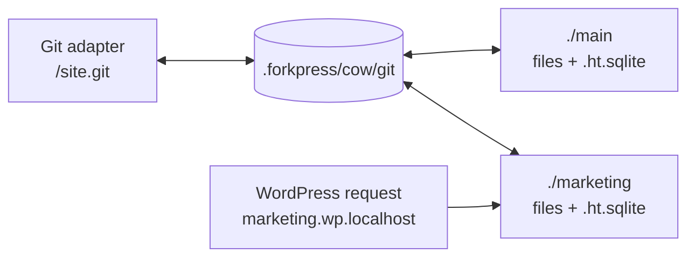
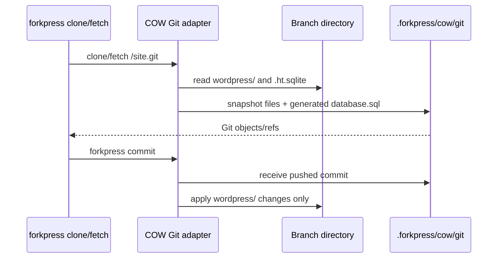

# Storage Driver Notes

Status: 2026-05-04

ForkPress is focused on the **COW materialized driver** on macOS. Other
drivers remain in the repo either for compatibility or research, but they are
not the product path.

The distribution constraint still stands: one `forkpress` binary per target,
with no Docker runtime, system PHP, MySQL daemon, FUSE service, helper daemon,
or installed database server.

## Driver Summary

| Driver | Status | Use it for | Main gaps |
| --- | --- | --- | --- |
| COW materialized | Product path on macOS. `strategy = "cow"`. | Normal WordPress directories, branch-local SQLite databases, Git clone/fetch/push, agent worktrees. | macOS is the primary supported target. Merge/reset semantics for database state are still explicit future work. |
| BranchFS + SQLite COW | Compatibility backend. `strategy = "branchfs"`. | Older `.forkpress/site.fp` sites and Linux default while COW is Mac-first. | Complex SQL overlay surface: WordPress MySQL-shaped queries pass through SQLite translation plus branch views/triggers. |
| CAS + Redb manifests | Experimental. `strategy = "cas"`. | Lazy file-store research using Redb and the PHP `branchfs` extension. | Git smart HTTP, locking, GC, and production durability are not complete. |
| Embedded OpenZFS engine | Disabled product feature. Code remains in-tree. | Research only. Build with `FORKPRESS_ENABLE_EMBEDDED_ZFS=1`; CLI smoke is hidden behind `FORKPRESS_ENABLE_ZFS_CLI=1`. | Not connected to branch operations. License/portability/product-shape questions remain. |

## COW Materialized Model

The COW driver keeps branch state in ordinary directories:

```text
.forkpress/
  site.toml
  cow/
    branches.txt
    git/                  # persistent Git adapter object store
  macos-cow/              # optional APFS sparsebundle fallback
  runtime/
  logs/
main/
  wp-content/database/.ht.sqlite
marketing/
  wp-content/database/.ht.sqlite
```

Each branch has:

- a complete WordPress file tree;
- its own SQLite database at `wp-content/database/.ht.sqlite`;
- no SQL overlay views;
- no parent table prefix;
- no shared mutable database file.

Writing to `./marketing/wp-content/database/.ht.sqlite` cannot affect
`./main/wp-content/database/.ht.sqlite` because they are different files.
Writing to `./marketing/wp-content/themes/...` cannot affect `./main/...`
because APFS/file clones are copy-on-write at the filesystem extent layer.



The branch directory is the runtime source of truth. `.forkpress/cow/git` is a
Git protocol adapter: it snapshots branch directories before clone/fetch/push
and applies pushed `wordpress/` file changes back to the branch directory.

## File View Cascade

ForkPress prefers ordinary paths because editors, shells, PHP, WP-CLI, backup
tools, and debuggers already know how to work with them.

On macOS, `forkpress init` chooses the first working file view:

1. **APFS clonefile in place.** The branch directories live directly in the
   project directory. Branch creation uses `clonefile`, so unchanged blocks are
   shared until a branch writes to them.
2. **Rootless APFS sparsebundle.** If the project volume cannot clone files,
   ForkPress creates `.forkpress/macos-cow/branches.sparsebundle`, mounts it at
   `.forkpress/macos-cow/mount`, and symlinks public branch directories to the
   APFS-backed physical branch trees.
3. **Full file copy.** This is the last-resort fallback.

`du`, Finder, and many disk analyzers can over-count cloned files because they
sum path sizes rather than unique allocated extents. On sparsebundle-backed
sites, watch the sparsebundle's allocated size or run:

```bash
df -h .forkpress/macos-cow/mount
```

## Git Adapter

The Git checkout always exposes:

```text
database.sql
wordpress/
```

`database.sql` is generated from the branch-local SQLite database and is
read-only from ForkPress' perspective. Pushing a modified `database.sql` does
not mutate WordPress database state.



Before each Git request, the adapter snapshots the current branch directories
into `.forkpress/cow/git`. This means direct edits in `./main` or
`./marketing` become visible to Git on the next clone/fetch.

After a push, the adapter applies the pushed `wordpress/` tree to the target
branch directory. Database files under `wp-content/database/.ht.sqlite*` are
never exported through Git and are not removed during Git apply.

New branches should be created through `forkpress branch create` or
`forkpress agents`, not by pushing an arbitrary new Git ref. The CLI path can
select APFS clonefile or sparsebundle-backed storage before the branch becomes
visible to Git.

## Branch Operations

Implemented for COW:

- `forkpress init`
- `forkpress serve`
- `forkpress stop`
- `forkpress branch list`
- `forkpress branch create <name> [--from main]`
- `forkpress branch show <name>`
- `forkpress branch delete <name>`
- `forkpress clone`
- `forkpress commit`
- `forkpress pull`
- `forkpress agents`
- WordPress admin/editor previews per branch
- generated `database.sql` in Git checkouts

Still future work:

- semantic database merge between branches;
- branch rollback/reset for both files and database together;
- COW-specific garbage collection/compaction beyond ordinary filesystem
  cleanup;
- stronger long-running branch locks around branch clone/export during active
  WordPress writes;
- Windows and Linux COW parity.

## ZFS Status

The embedded ZFS work is parked. The C code, shims, and Rust FFI are still in
the repo so we do not lose the research, but it is not built in normal release
or developer builds.

To opt into that research path locally:

```bash
FORKPRESS_ENABLE_EMBEDDED_ZFS=1 cargo build -p forkpress
FORKPRESS_ENABLE_ZFS_CLI=1 ./target/debug/forkpress zfs smoke
```

Do not document or present ZFS as a user-facing storage option until it is
connected to actual branch import/export and the licensing/product-shape
questions are resolved.
