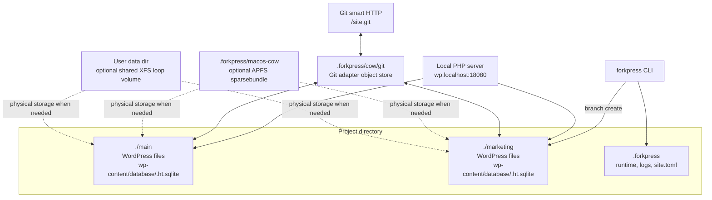

# Storage overview

ForkPress production storage is the materialized copy-on-write model. Branches
are ordinary WordPress directories, and branch creation uses filesystem
copy-on-write when the machine can provide it.



The durable WordPress state for a branch is the branch directory itself. Git is
only a protocol adapter over those directories.

## Selected file view

ForkPress records the selected storage strategy in `.forkpress/site.toml`:

```toml
version = 1
strategy = "cow"
file_view = "reflink"
```

The file view tells ForkPress where physical branch trees live and which
copy-on-write primitive is available.

| Platform | Default | Fallback |
| --- | --- | --- |
| macOS | APFS `clonefile` in the project directory. | Rootless APFS sparsebundle under `.forkpress/macos-cow`. |
| Linux | `FICLONE` reflinks in the project directory. | Shared XFS loop volume under the user's ForkPress data directory. |
| Windows | ReFS block cloning on a Dev Drive. | Dev Drive setup through the Windows installer. |

Full file-copy materialization is available only when explicitly requested. It
is not part of the automatic copy-on-write cascade.

## Diagnostics

Inspect the selected file view:

```bash
forkpress storage status
forkpress doctor storage
```

For command options, see [`forkpress storage`](../cli/storage.md) and
[`forkpress doctor`](../cli/doctor.md).

`storage status` reports branch count, the public branch root, the physical
storage root, lifecycle lock paths, and leftover staging directories from
interrupted branch operations.

Tools such as `du`, Finder, Explorer, and many disk analyzers can over-count
cloned files because they add up path sizes rather than unique allocated
extents. Prefer filesystem-level free-space measurements when checking physical
growth.

Before moving or deleting a site with mount-backed storage, stop it through
ForkPress:

```bash
forkpress stop
```

On Linux XFS-loop sites, remove the hidden per-site directory inside the shared
mount before deleting the project. `forkpress storage detach` prints the exact
cleanup command while the volume is still attached.
